# OpenStack Control Plane Backup and Restore Procedure (Stateless Services)

## Overview

This procedure is designed for **Red Hat OpenShift** deployments using the `oc` CLI client.

This procedure covers backup and restore of the OpenStack Control Plane focusing on **stateless services only**. It excludes:
- Database data (Galera/MariaDB)
- OVN databases
- PersistentVolumes/PersistentVolumeClaims
- RabbitMQ message queue data (persistent messages)

## Scope

### Services Covered (Stateless)
- **API Services**: Keystone, Placement, Nova, Glance, Cinder, Neutron, Horizon, Heat, Ironic, Manila, Barbican, Designate, Octavia
- **Control Services**: Nova Conductor, Nova Scheduler, Cinder Scheduler, Heat Engine
- **Caching**: Memcached, Redis (non-persistent)

### Important: EDPM/Data Plane Node Dependencies

⚠️ **This procedure includes critical steps for EDPM deployments**

If you have **External Data Plane Management (EDPM)** nodes deployed (compute nodes, network nodes), the **manual RabbitMQ user restoration step** is mandatory. See the RabbitMQ User Management section below for details.

### Key Principle
All services are **operator-managed** and **stateless**. The operator will automatically recreate all resources (Deployments, Services, ConfigMaps, etc.) when you restore the Custom Resources.

### RabbitMQ User Management

**Understanding RabbitMQ Users in OpenStack:**

1. **RabbitMQ Cluster Creation**: When you deploy OpenStackControlPlane, the operator creates RabbitMQ clusters (e.g., `rabbitmq`, `rabbitmq-cell1`, `rabbitmq-notifications`)

2. **Default User**: Each RabbitMQ cluster has a default admin user with credentials stored in a secret named `<rabbitmq-name>-default-user`. This user is auto-generated with a random username and password.

3. **Shared User Model**: **IMPORTANT** - Currently, all OpenStack services share the same default RabbitMQ user. Each service creates a `TransportURL` CR, which generates a transport URL secret, but they all reference the **same default user credentials** (not individual per-service users).

4. **Restore Challenge**: When you restore the control plane:
   - **A NEW RabbitMQ cluster gets created** (no queue data restored)
   - New default admin credentials are **automatically generated** (different from backup)
   - **MANUAL STEP REQUIRED**: You must restore the original user credentials to the new cluster by exec'ing into the RabbitMQ pods. This will change in later version where we have the RabbitMQUser CRD which allows us to create users referencing an secret which holds the password to use.
   - This ensures all services can reconnect (TransportURL CRs will regenerate the transport URL secrets automatically)

**Fresh Cluster Strategy:**

This procedure creates a **brand new RabbitMQ cluster** instead of restoring the old one:

**Why Fresh Cluster?**
- Avoids complexity of queue state restoration
- Eliminates stale messages that might cause issues
- Provides clean messaging layer for restored services
- Allows for fresh cluster configuration

**What Happens During Restore:**
1. Old RabbitMQ clusters are deleted during cleanup
2. New RabbitMQ clusters are created when OpenStackControlPlane CR is restored
3. New default admin credentials are automatically generated (different from backup)
4. **MANUAL STEP**: You restore the backed-up user credentials by exec'ing into RabbitMQ pods
5. Service operators reconcile and TransportURL CRs are created/updated
6. Operator automatically generates new transport URL secrets referencing the restored credentials
7. All services connect to new RabbitMQ using the restored credentials

**Impact:**
- ✅ No stale messages or queue corruption
- ✅ Clean start for message bus
- ✅ Services use restored credentials from backup (continuity for EDPM nodes)
- ❌ Any in-flight messages are lost (acceptable for stateless restore)
- ⚠️ **Requires manual step** to restore user credentials

**What to Backup:**
- ✅ **RabbitMQ default user secrets** (CRITICAL - needed for manual user restoration)
- ❌ RabbitMQ queue data (out of scope - fresh cluster created)
- ❌ **Transport URL secrets** (automatically regenerated by the operator when TransportURL CRs reconcile)

**Why User Restoration is CRITICAL:**

This is not optional - it's **absolutely required** for production deployments with data plane nodes:

1. **EDPM/Data Plane Node Impact**: External Data Plane Management (EDPM) nodes - **compute and network nodes** - are configured with RabbitMQ credentials during deployment

2. **Services on Data Plane Nodes**:
   - nova-compute agents (connect to cell RabbitMQ)
   - ceilometer-compute agents (connect to RabbitMQ for metrics)
   - Maybe other compute/networker services

3. **Why Preserving Credentials is Required**:
   - Data plane nodes have RabbitMQ credentials in their configuration files
   - Changing RabbitMQ credentials with the restore would require **reconfiguring all dataplane nodes**
   - This is impractical and error-prone in production
   - **Manual user restoration provides immediate continuity**
   - EDPM nodes will get updated credentials on their next deployment run

4. **Control Plane vs Data Plane**:
   - Control plane services (in namespace) get updated credentials automatically via TransportURL CRs
   - Data plane nodes (external) need the backed-up credentials restored for immediate connectivity
   - On the next EDPM deployment run, data plane nodes will be updated with current credentials
   - **The data plane dependency makes credential preservation mandatory for immediate restore**

5. **Critical RabbitMQ Clusters for Data Plane**:
   - **Cell RabbitMQ** (e.g., rabbitmq-cell1) - Used by nova-compute on compute nodes
   - **Notifications RabbitMQ** (rabbitmq-notifications) - Used by ceilometer-compute on data plane nodes

**Without this manual restoration step**: You would need to immediately reconfigure all dataplane nodes with new credentials, causing extended downtime and operational complexity. With manual restoration, data plane nodes maintain connectivity immediately after restore, and can be updated with new credentials during their next regular EDPM deployment cycle.

---

## Restore Workflow with Staged Deployment

```mermaid
flowchart TD
    Start([Start Restore]) --> PreReq{Prerequisites Exist?<br/>✓ StorageClass<br/>✓ NNCP<br/>✓ MetalLB}
    PreReq -->|Missing| RestorePreReq[Restore/Create Prerequisites:<br/>- StorageClass<br/>- NodeNetworkConfigurationPolicy<br/>- MetalLB IPAddressPool & L2Advertisement]
    RestorePreReq --> PreReq
    PreReq -->|Ready| Backup[Extract Backup Archive]
    Backup --> RestoreNAD[Restore NetworkAttachmentDefinitions]
    RestoreNAD --> RestoreSecrets[Restore Secrets<br/>filtered: user-provided + CA + DB passwords]
    RestoreSecrets --> RestoreConfigMaps[Restore ConfigMaps<br/>filtered: user-provided only]
    RestoreConfigMaps --> RestoreIssuers[Restore TLS Issuers]
    RestoreIssuers --> RestoreMariaDBCRs[Restore MariaDBDatabase &<br/>MariaDBAccount CRs]
    RestoreMariaDBCRs --> RestoreCtlPlane[Restore OpenStackControlPlane CR<br/>with annotation:<br/>deployment-stage=infrastructure-only]

    RestoreCtlPlane --> WaitInfra{Wait for<br/>OpenStackControlPlane<br/>InfrastructureReady<br/>condition}
    WaitInfra -->|Not Ready| WaitInfra
    WaitInfra -->|Ready| InfraReady[Infrastructure Ready:<br/>✓ Galera<br/>✓ OVN NB/SB<br/>✓ RabbitMQ<br/>✓ Memcached]

    InfraReady --> RestoreMariaDB[Restore MariaDB Database Contents]
    RestoreMariaDB --> RestoreOVN[Restore OVN Database Contents<br/>NB & SB databases]
    RestoreOVN --> RestoreRabbitMQ[Restore RabbitMQ User Credentials<br/>for EDPM compatibility]

    RestoreRabbitMQ --> Resume[Resume Deployment<br/>Remove deployment-stage annotation]

    Resume --> WaitServices{Wait for<br/>OpenStack Services<br/>to be Ready}
    WaitServices -->|Not Ready| WaitServices
    WaitServices -->|Ready| ServicesReady[Services Ready:<br/>✓ Keystone<br/>✓ Nova<br/>✓ Neutron<br/>✓ Glance<br/>etc.]

    ServicesReady --> Verify[Verify:<br/>1. Database contents<br/>2. OVN state<br/>3. Service functionality]
    Verify --> End([Restore Complete])

    style PreReq fill:#FFA07A
    style RestorePreReq fill:#FFE4B5
    style InfraReady fill:#90EE90
    style ServicesReady fill:#90EE90
    style RestoreCtlPlane fill:#FFE4B5
    style Resume fill:#FFE4B5
    style WaitInfra fill:#87CEEB
    style WaitServices fill:#87CEEB
```



**Key Points:**
- **Prerequisites**: Cluster infrastructure must exist first (StorageClass, NNCP, MetalLB) - either still present or restored separately
- **Staged Deployment**: Infrastructure (databases, message queue) is created first with annotation `deployment-stage=infrastructure-only`
- **OpenStackControlPlaneInfrastructureReady Condition**: Single condition check validates all infrastructure components are ready
- **Database Restore**: Performed while OpenStack services are NOT yet created (clean restore)
- **Resume Deployment**: Removing the `deployment-stage` annotation triggers creation of OpenStack services
- **Services Start Clean**: Keystone, Nova, etc. start with already-restored databases (no restarts needed)

**Important**: While we don't backup RabbitMQ queue data, we create a fresh RabbitMQ cluster on restore. The RabbitMQ default user credentials **MUST be backed up and manually restored** for EDPM/data plane deployments. See "RabbitMQ User Management" in the Scope section for details.

## Prerequisites

Before starting the backup or restore procedure, ensure you have:

### General Requirements

1. **OpenShift CLI (`oc`) installed** - Version compatible with your cluster
2. **Cluster access** - Valid credentials with appropriate permissions
3. **Logged into the cluster**:

```bash
# Login to your OpenShift cluster
oc login https://api.your-cluster.example.com:6443 --username <username> --password <password>

# Or use token-based authentication
oc login --token=<token> --server=https://api.your-cluster.example.com:6443

# Verify you're connected
oc whoami
oc project openstack
```

4. **Sufficient permissions** - Cluster admin or namespace admin rights for the `openstack` namespace
5. **Storage for backups** - Local or remote location to store backup archives

### Operator Version Requirements

**CRITICAL**: The target cluster (where you restore) must have the **same versions** of the OpenStack operators as the source cluster (where you backed up).

#### Why Version Matching is Critical:

1. **CRD Schema Changes**: Operator upgrades may change Custom Resource Definition schemas
2. **API Compatibility**: Different operator versions may expect different CR field structures
3. **Feature Compatibility**: New operators may have different default behaviors
4. **Container Images**: OpenStackVersion CR tracks specific container image versions

#### Check Operator Versions Before Backup:

```bash
# Check installed OpenStack operators via ClusterServiceVersion (CSV)
oc get csv -n openstack-operators

# Check subscriptions (shows the channel and source)
oc get subscription -n openstack-operators

# Check install plans (shows what's being installed/approved)
oc get installplan -n openstack-operators
```

#### Document Operator Versions During Backup:

```bash
# Create operator version manifest using CSV (ClusterServiceVersion)
cat > operator-versions.txt <<EOF
Backup Date: $(date)
OpenShift Version: $(oc version -o json | jq -r '.openshiftVersion')

Installed Operators (CSV):
$(oc get csv -n openstack-operators)

Subscriptions:
$(oc get subscription -n openstack-operators)
EOF

# Save detailed CSV and subscription info
oc get csv -n openstack-operators -o json | jq 'del(.items[].metadata.ownerReferences, .items[].metadata.uid, .items[].metadata.resourceVersion, .items[].metadata.creationTimestamp, .items[].metadata.managedFields, .metadata)' > csv-backup.json
oc get subscription -n openstack-operators -o json | jq 'del(.items[].metadata.ownerReferences, .items[].metadata.uid, .items[].metadata.resourceVersion, .items[].metadata.creationTimestamp, .items[].metadata.managedFields, .metadata)' > subscription-backup.json

# Check which catalog sources are being used
oc get subscription -n openstack-operators -o jsonpath='{.items[*].spec.source}' | tr ' ' '\n' | sort -u

# If using custom CatalogSource (not default redhat-operators), back it up
# For default OpenShift catalogs (redhat-operators, certified-operators, etc.), backup is NOT needed
# Only backup if you see custom catalog names:
# oc get catalogsource -n openshift-marketplace <custom-catalog-name> -o json > catalogsource-backup.json

# Include in backup archive
```

#### Verify Target Cluster Has Matching Versions:

```bash
# On target cluster, verify installed operator versions match
oc get csv -n openstack-operators

# Compare with source cluster versions from operator-versions.txt

# Check subscriptions match (channel, approval strategy)
oc get subscription -n openstack-operators

# If versions don't match, DO NOT proceed with restore
# Either:
# 1. Install/approve matching operator versions on target cluster (ensure same CSV versions), OR
# 2. Upgrade source cluster operators, create new backup, then restore
```

#### CatalogSource Requirements:

**When CatalogSource backup is NOT needed:**
- Using default OpenShift OperatorHub catalogs (e.g., `redhat-operators`, `certified-operators`, `community-operators`)
- These catalogs are cluster-wide resources that come pre-configured with OpenShift
- Any OpenShift cluster will have these default catalogs available

**When CatalogSource backup IS needed:**
- Using a custom CatalogSource pointing to a private/internal registry
- Using custom index images for testing or development
- Using organization-specific operator catalogs

To verify if you need to backup CatalogSource:

```bash
# Check which catalog sources your subscriptions are using
oc get subscription -n openstack-operators -o jsonpath='{.items[*].spec.source}' | tr ' ' '\n' | sort -u

# If output shows "redhat-operators" or similar default catalogs: NO backup needed
# If output shows custom catalog names: Backup those CatalogSource resources

# To backup a custom CatalogSource (if needed):
oc get catalogsource -n openshift-marketplace <custom-catalog-name> -o yaml > catalogsource-backup.yaml
```

### OpenStackVersion CR Considerations

The `OpenStackVersion` CR defines container image versions for all OpenStack services. This CR must be compatible with the installed operators.

```bash
# Check OpenStackVersion during backup
oc get openstackversion -n openstack -o yaml

# Note the version and containerImages section
# This determines which container images are used for all services
```

**Important**: If you restore to a cluster with different operator versions, the OpenStackVersion CR may:
- Be rejected due to schema changes
- Use incompatible container images
- Cause operator reconciliation failures

### Storage Class Requirements

The target cluster must have the same storage classes available, or you must update the backup files before restore. Note that the OpenStackControlPlane CR defines a global `storageClass`, but individual services (Galera, RabbitMQ, OVN, etc.) can override this with service-specific storage class parameters in their template specifications.

```bash
# Check storage classes during backup
oc get storageclass

# Document storage classes used by services
# Note: Services can override the global storageClass with service-specific parameters
# Global storage class:
oc get openstackcontrolplane -n openstack -o jsonpath='{.items[0].spec.storageClass}'

# Service-specific storage classes may be defined in:
# - spec.galera.templates[*].storageClass
# - spec.rabbitmq.templates[*].persistence.storageClassName
# - spec.ovn.template.ovnDBCluster[*].storageClass
# - Other service-specific storage configurations
```

---

## Automated Backup and Restore Scripts

For automated testing, two bash scripts are provided that implement the exact procedures documented below:

### Backup Script

```bash
# Basic usage
./backup-openstack-ctlplane.sh

# With custom namespace
NAMESPACE=openstack-prod ./backup-openstack-ctlplane.sh

# With custom backup directory
BACKUP_DIR_BASE=/mnt/backups ./backup-openstack-ctlplane.sh
```

The script creates a timestamped backup archive following all steps in the backup procedure.

**Script location**: `docs/dev/backup-openstack-ctlplane.sh`

### Restore Script

```bash
# Basic usage
./restore-openstack-ctlplane.sh openstack-ctlplane-backup-20260119-120000.tar.gz

# With custom namespace
NAMESPACE=openstack-prod ./restore-openstack-ctlplane.sh backup.tar.gz

# Skip cleanup of existing resources
SKIP_CLEANUP=true ./restore-openstack-ctlplane.sh backup.tar.gz

# Skip RabbitMQ user restoration (not recommended)
SKIP_RABBITMQ_RESTORE=true ./restore-openstack-ctlplane.sh backup.tar.gz
```

The script follows the correct restore order and prompts for confirmation at critical steps.

**Script location**: `docs/dev/restore-openstack-ctlplane.sh`

**Environment Variables**:
- `NAMESPACE`: Target namespace (default: `openstack`)
- `SKIP_CLEANUP`: Skip cleanup of existing resources (default: `false`)
- `SKIP_RABBITMQ_RESTORE`: Skip RabbitMQ user restoration (default: `false`)
- `BACKUP_DIR_BASE`: Backup directory base path (default: `./backups`)

---

## Backup Procedure

### 1. Backup OpenStackControlPlane CR

```bash
# Export the main control plane CR
oc get openstackcontrolplane -n openstack -o json | \
  jq 'del(.items[].metadata.uid,
          .items[].metadata.resourceVersion,
          .items[].metadata.creationTimestamp,
          .items[].metadata.managedFields,
          .metadata)' > openstackcontrolplane-backup.json
```

### 2. Backup Related Custom Resources

**TODO**: Review and expand this list of CRs to backup. There may be additional Custom Resources that need to be included in the backup procedure.

```bash
# Backup OpenStackVersion
oc get openstackversion -n openstack -o json | \
  jq 'del(.items[].metadata.ownerReferences,
          .items[].metadata.uid,
          .items[].metadata.resourceVersion,
          .items[].metadata.creationTimestamp,
          .items[].metadata.managedFields,
          .metadata)' > openstackversion-backup.json

# Backup NetConfig (CRITICAL - defines network topology, subnets, IP allocation)
oc get netconfig -n openstack -o json | \
  jq 'del(.items[].metadata.uid,
          .items[].metadata.resourceVersion,
          .items[].metadata.creationTimestamp,
          .items[].metadata.managedFields,
          .metadata)' > netconfig-backup.json

# Backup any Topology CRs
oc get topology -n openstack -o json | \
  jq 'del(.items[].metadata.ownerReferences,
          .items[].metadata.uid,
          .items[].metadata.resourceVersion,
          .items[].metadata.creationTimestamp,
          .items[].metadata.managedFields,
          .metadata)' > topology-backup.json 2>/dev/null || echo "No topology found"
```

**Note**: We do NOT backup operator-created service CRs (KeystoneAPI, PlacementAPI, Nova, Neutron, etc.) as they are automatically recreated by the operator when the OpenStackControlPlane CR reconciles. The control plane CR spec contains all the configuration needed to recreate these resources.

**Note**: We also do NOT backup operator-managed ServiceAccounts, Roles, or RoleBindings. These are automatically created by the operators during reconciliation. If you have custom ServiceAccounts or RBAC resources outside the scope of the OpenStack operators, you should back them up separately - they are not part of the control plane backup.

### 3. Backup NetworkAttachmentDefinitions

NetworkAttachmentDefinitions (NADs) define the networks used by OpenStack services and are required for the control plane to function properly.

```bash
# Backup all NetworkAttachmentDefinitions in the namespace
oc get network-attachment-definition -n openstack -o json | \
  jq 'del(.items[].metadata.uid,
          .items[].metadata.resourceVersion,
          .items[].metadata.creationTimestamp,
          .items[].metadata.managedFields,
          .metadata)' > network-attachment-definitions-backup.json
```

**Note**: NNCP (NodeNetworkConfigurationPolicy) and MetalLB resources are cluster-scoped infrastructure prerequisites that users create before deploying OpenStack. These are the user's responsibility to backup separately as they are not part of the namespace-scoped OpenStack control plane backup. They must exist on the target cluster before restore.

### 4. Backup Secrets

**Strategy**: Backup application secrets, preserving `ownerReferences` for restore filtering. Exclude auto-generated Kubernetes system secrets. Remove runtime metadata.

```bash
# Backup secrets, excluding auto-generated system secrets
# Preserve ownerReferences for restore filtering, remove runtime metadata
oc get secrets -n openstack -o json | \
  jq '.items |= map(select(.type != "kubernetes.io/dockercfg" and .type != "kubernetes.io/service-account-token")) |
      del(.items[].metadata.uid,
          .items[].metadata.resourceVersion,
          .items[].metadata.creationTimestamp,
          .items[].metadata.managedFields,
          .items[].metadata.annotations."kubectl.kubernetes.io/last-applied-configuration",
          .metadata)' > secrets-all-backup.json
```

**Auto-generated secrets that are excluded:**
- `kubernetes.io/dockercfg` - Service account image pull secrets (auto-generated by Kubernetes)
- `kubernetes.io/service-account-token` - Service account tokens (auto-generated by Kubernetes)

These are recreated automatically by Kubernetes when service accounts are created, so they don't need to be backed up.

**Why PRESERVE ownerReferences:**
- ownerReferences allow smart filtering during restore
- Restore can distinguish between user-provided secrets (no owner) and operator-managed secrets (have owner)
- Only user-provided secrets + critical exceptions (CA secrets, DB passwords) are restored
- Operators recreate their own secrets during reconciliation
- ownerReferences are just metadata - they don't cause restore conflicts
- Operators will update ownerReferences as needed during reconciliation

**Why remove runtime metadata fields:**

These are **cluster-specific runtime metadata** that Kubernetes manages automatically. Including them causes conflicts during restore:

- **`uid`**: Unique identifier assigned by Kubernetes. Each resource gets a NEW uid when created. Applying with a non-existent uid causes rejection.
- **`resourceVersion`**: Tracks the version in etcd for optimistic concurrency control. Old versions from source cluster conflict with target cluster state.
- **`creationTimestamp`**: Set automatically by API server. Cannot be set manually - will be ignored or cause validation errors.
- **`generation`**: Incremented when `.spec` changes. Starting fresh makes sense on restore (begins at generation 1).
- **`managedFields`**: Tracks which controllers manage which fields (Server-Side Apply). Old managedFields reference old controller instances, causing conflicts when new controllers reconcile.

By removing these fields, we provide the **desired state** (spec + data) and let Kubernetes manage runtime metadata as if creating fresh resources.

**Critical secrets included in this backup:**
- Main OpenStack secret (user-provided credentials)
- RabbitMQ default user secrets (critical for data plane connectivity)
- Root CA secrets (TLS certificate authorities)
- Certificate secrets (TLS certificates)
- Transport URL secrets (will be regenerated, but backup doesn't hurt)
- All operator-generated config secrets

**CRITICAL - RabbitMQ Secrets Backup:**

⚠️ **IMPORTANT FOR EDPM/DATA PLANE DEPLOYMENTS**: The `rabbitmq-*-default-user` secrets **MUST be backed up**. These credentials will be manually restored to the new RabbitMQ clusters during the restore procedure to ensure data plane node connectivity. See "RabbitMQ User Management" in the Scope section for details on why this is required.

### 5. Backup MariaDB Resources

**CRITICAL**: MariaDBDatabase and MariaDBAccount CRs must be backed up to ensure database accounts maintain the same credentials after restore.

**Why backup MariaDB CRs:**
- **MariaDBDatabase** CRs define the OpenStack databases (keystone, nova, neutron, etc.)
- **MariaDBAccount** CRs define database user accounts and reference secrets containing passwords
- The database account passwords are stored in secrets (backed up in section 4)
- On restore, these CRs will adopt existing databases/accounts (using `CREATE IF NOT EXISTS`)
- The controllers will ensure account passwords match the restored secrets
- Without the CRs, database accounts would need manual recreation

**Operations are idempotent:**
- `CREATE DATABASE IF NOT EXISTS` - adopts existing databases without data loss
- `CREATE USER IF NOT EXISTS` + `ALTER USER` - adopts existing accounts and updates passwords
- Safe to restore even if databases/accounts already exist in MariaDB

```bash
# Backup MariaDBDatabase CRs (defines databases)
oc get mariadbdatabase -n openstack -o json | \
  jq 'del(.items[].metadata.ownerReferences,
          .items[].metadata.uid,
          .items[].metadata.resourceVersion,
          .items[].metadata.creationTimestamp,
          .items[].metadata.managedFields,
          .metadata)' > mariadbdatabase-backup.json

# Backup MariaDBAccount CRs (defines database accounts)
oc get mariadbaccount -n openstack -o json | \
  jq 'del(.items[].metadata.ownerReferences,
          .items[].metadata.uid,
          .items[].metadata.resourceVersion,
          .items[].metadata.creationTimestamp,
          .items[].metadata.managedFields,
          .metadata)' > mariadbaccount-backup.json
```

**Note**: Database account password secrets (e.g., `keystonedb-secret`, `novadb-secret`) are already backed up in section 4 (all secrets backup). MariaDBAccount CRs reference these secrets by name.

### 6. Backup TLS Issuers and CA Secrets

**CRITICAL**: TLS is enabled by default in RHOSO deployments. You **MUST** back up CA secrets and Issuers. Regenerating with new CAs will break trust relationships and require reconfiguration of all clients (especially EDPM nodes).

**What gets backed up:**
- **CA secrets**: Already backed up in section 4 (CA private keys and certificates)
- **Issuer CRs**: Backed up here (define how certificates are issued using the CA)
- **Certificate CRs**: Backed up for disaster recovery but **NOT restored** (operators recreate these)
- **Service certificate secrets**: Already backed up in section 4 but **NOT restored** (cert-manager issues fresh ones)

**What gets restored:**
- ✅ **CA secrets** - Preserved to maintain trust chain
- ✅ **Issuer CRs** - Define certificate authorities
- ❌ **Certificate CRs** - Operators recreate during reconciliation
- ❌ **Service certificate secrets** - cert-manager issues fresh certificates

```bash
# Backup Issuer CRs (cert-manager issuers)
oc get issuer -n openstack -o json | \
  jq 'del(.items[].metadata.ownerReferences,
          .items[].metadata.uid,
          .items[].metadata.resourceVersion,
          .items[].metadata.creationTimestamp,
          .items[].metadata.managedFields,
          .metadata)' > issuer-backup.json

# Backup Certificate CRs (for disaster recovery archive - not used in restore)
oc get certificate -n openstack -o json | \
  jq 'del(.items[].metadata.ownerReferences,
          .items[].metadata.uid,
          .items[].metadata.resourceVersion,
          .items[].metadata.creationTimestamp,
          .items[].metadata.managedFields,
          .metadata)' > certificates-backup.json
```

**Why this approach:**

1. **CA secrets restored** - Maintains the same trust chain:
   - Services and EDPM nodes already trust this CA
   - No need to reconfigure clients
   - Same root of trust preserved

2. **Issuer CRs restored** - Tell cert-manager which CA to use:
   - References the restored CA secret
   - Ready before operators start creating Certificate CRs

3. **Certificate CRs NOT restored** - Operators recreate them:
   - ALL Certificate CRs have ownerReferences to operators
   - Operators create these during OpenStackControlPlane reconciliation
   - Follows Kubernetes operator ownership pattern

4. **Fresh service certificates issued** - Best practice:
   - cert-manager issues new certificates with fresh expiry dates
   - Uses the restored CA (same trust chain)
   - No risk of restoring expired or soon-to-expire certificates
   - Clean certificate lifecycle

**Certificate Rotation After Restore:**

After restore, cert-manager handles certificate rotation:
- Operators create Certificate CRs during reconciliation
- cert-manager issues certificates from the restored CA
- Certificates are monitored for expiration
- Automatic renewal when certificates approach expiry
- New CertificateRequests created as needed

**About CertificateRequests:**

CertificateRequests are **NOT** backed up - they are ephemeral records created by cert-manager during certificate issuance. After restore, cert-manager creates new CertificateRequests as needed.

### 7. Backup ConfigMaps

**Strategy**: Backup ALL ConfigMaps, preserving `ownerReferences` for restore filtering. Remove runtime metadata.

```bash
# Backup all ConfigMaps in the namespace
# Preserve ownerReferences for restore filtering, remove runtime metadata
oc get configmaps -n openstack -o json | \
  jq 'del(.items[].metadata.uid,
          .items[].metadata.resourceVersion,
          .items[].metadata.creationTimestamp,
          .items[].metadata.managedFields,
          .metadata)' > configmaps-all-backup.json
```

**Why backup ConfigMaps:**
- Contains service configurations
- Some may have user-provided custom configurations
- Operators will regenerate operator-managed ConfigMaps
- Backup ensures user-provided ConfigMaps are preserved

**Why PRESERVE ownerReferences:**
- Allows smart filtering during restore (same as Secrets)
- Restore only applies to user-provided ConfigMaps (no ownerReferences)
- Operators recreate their own ConfigMaps during reconciliation
- See section 4 for detailed explanation of why runtime metadata fields are removed

### 8. Document Operator and Platform Versions

```bash
# Create operator version manifest
cat > operator-versions.txt <<EOF
========================================
OpenStack Control Plane Backup Metadata
========================================
Backup Date: $(date)
Backup Created By: $(oc whoami)

OpenShift Cluster Information:
- Cluster Version: $(oc version -o json | jq -r '.openshiftVersion')
- Kubernetes Version: $(oc version -o json | jq -r '.serverVersion.gitVersion')
- Console URL: $(oc whoami --show-console)

Namespace: $(oc project -q)

Installed Operators (ClusterServiceVersions):
EOF

# Append CSV information
oc get csv -n openstack-operators >> operator-versions.txt

# Document subscriptions
echo "" >> operator-versions.txt
echo "Operator Subscriptions:" >> operator-versions.txt
oc get subscription -n openstack-operators >> operator-versions.txt

# Document install plans
echo "" >> operator-versions.txt
echo "Install Plans:" >> operator-versions.txt
oc get installplan -n openstack-operators >> operator-versions.txt

# Document storage classes used by services
echo "" >> operator-versions.txt
echo "Storage Configuration:" >> operator-versions.txt
echo "Note: Services can override the global storageClass with service-specific parameters" >> operator-versions.txt
echo "- Global StorageClass: $(oc get openstackcontrolplane -n openstack -o jsonpath='{.items[0].spec.storageClass}')" >> operator-versions.txt
echo "- Available StorageClasses in cluster:" >> operator-versions.txt
oc get storageclass --no-headers | awk '{print "  - " $1}' >> operator-versions.txt

# Save detailed CSV and subscription information
oc get csv -n openstack-operators -o json | \
  jq 'del(.items[].metadata.ownerReferences,
          .items[].metadata.uid,
          .items[].metadata.resourceVersion,
          .items[].metadata.creationTimestamp,
          .items[].metadata.managedFields,
          .metadata)' > csv-backup.json

oc get subscription -n openstack-operators -o json | \
  jq 'del(.items[].metadata.ownerReferences,
          .items[].metadata.uid,
          .items[].metadata.resourceVersion,
          .items[].metadata.creationTimestamp,
          .items[].metadata.managedFields,
          .metadata)' > subscription-backup.json

oc get installplan -n openstack-operators -o json | \
  jq 'del(.items[].metadata.ownerReferences,
          .items[].metadata.uid,
          .items[].metadata.resourceVersion,
          .items[].metadata.creationTimestamp,
          .items[].metadata.managedFields,
          .metadata)' > installplan-backup.json

echo "Operator versions documented in operator-versions.txt"
echo "Detailed operator info saved: csv-backup.json, subscription-backup.json, installplan-backup.json"
```

### 9. Create Backup Archive

```bash
# Create timestamped backup directory
BACKUP_DATE=$(date +%Y%m%d-%H%M%S)
BACKUP_DIR="openstack-ctlplane-backup-${BACKUP_DATE}"
mkdir -p ${BACKUP_DIR}

# Move all backup files
mv *-backup.json ${BACKUP_DIR}/
mv operator-versions.txt ${BACKUP_DIR}/

# Create a README for the backup
cat > ${BACKUP_DIR}/README.md <<EOF
# OpenStack Control Plane Backup

Created: $(date)
Source Cluster: $(oc whoami --show-console)
Namespace: openstack

## Contents

All backup files are in JSON format for consistency.

### Control Plane CRs
- openstackcontrolplane-backup.json: Main control plane CR
- openstackversion-backup.json: OpenStack version and container images
- netconfig-backup.json: Network configuration (CRITICAL)
- topology-backup.json: Topology configuration (if used)

### Network Resources (ownerReferences removed)
- network-attachment-definitions-backup.json: NetworkAttachmentDefinitions (CRITICAL)

### Secrets and ConfigMaps (ownerReferences removed)
- secrets-all-backup.json: All secrets (includes OpenStack secrets, RabbitMQ, TLS CAs, certificates)
- configmaps-all-backup.json: All ConfigMaps

### TLS Infrastructure
- issuer-backup.json: cert-manager Issuer CRs (RESTORED - define certificate authorities)
- certificates-backup.json: cert-manager Certificate CRs (NOT RESTORED - operators recreate these)

### Operator Version Information
- operator-versions.txt: Operator and platform versions (human-readable summary)
- csv-backup.json: ClusterServiceVersion details
- subscription-backup.json: Subscription details
- installplan-backup.json: InstallPlan details

## Restore Instructions

See: docs/dev/backup-restore-stateless.md

**IMPORTANT**: Target cluster must have matching operator versions!
Check operator-versions.txt for required versions.
EOF

# Create archive
tar -czf ${BACKUP_DIR}.tar.gz ${BACKUP_DIR}

echo "Backup archive created: ${BACKUP_DIR}.tar.gz"
echo "Total size: $(du -h ${BACKUP_DIR}.tar.gz | cut -f1)"

# Store securely (examples)
# scp ${BACKUP_DIR}.tar.gz backup-server:/backups/
# oc create secret generic openstack-backup-${BACKUP_DATE} --from-file=${BACKUP_DIR}.tar.gz -n openstack-backups
```

---

## Restore Procedure

### Important: Restore Order Matters

The restore procedure **must** follow a specific order to ensure cert-manager issues fresh certificates from the same CA and the OpenStack control plane reconciles correctly:

1. **NetworkAttachmentDefinitions** - Required network resources (user-provided)
2. **Secrets** - Smart filtering: user-provided + CA secrets + database passwords. Excludes RabbitMQ-related, certificate secrets (service-cert label), and other operator-managed secrets
3. **ConfigMaps** - Smart filtering: user-provided only (no ownerReferences). Operator-managed ConfigMaps (including RabbitMQ) automatically excluded
4. **TLS Issuers** - Establish cert-manager authority (needs CA secrets from step 2). Includes operator-managed and custom Issuers
5. **MariaDBDatabase CRs** - Define databases, restored AFTER secrets (database operations use `CREATE IF NOT EXISTS`)
6. **MariaDBAccount CRs** - Define database accounts, restored AFTER databases (needs database passwords, uses `CREATE IF NOT EXISTS` + `ALTER USER`)
7. **Related CRs** (NetConfig, OpenStackVersion, Topology) - Required before OpenStackControlPlane
8. **OpenStackControlPlane CR** - Triggers operator reconciliation (operators create Certificate CRs, cert-manager issues fresh certificates)
9. **RabbitMQ User Credentials** - Manual restoration AFTER RabbitMQ clusters are created (extracts credentials from backup and applies them to fresh clusters)

**Smart Filtering Philosophy**: Only restore what users provided or what's critical for state preservation. Let operators recreate what they own.

**What's NOT restored:**
- ❌ **Certificate CRs** - ALL Certificate CRs (CA and service) have ownerReferences. Operators recreate them during reconciliation.
- ❌ **Certificate Secrets** - Have `service-cert` label. cert-manager recreates them fresh when operators create Certificate CRs.
- ❌ **RabbitMQ Secrets** - Name starts with `rabbitmq-`. Operators create fresh ones. User credentials manually restored later.
- ❌ **Other Operator-managed Secrets** - Have ownerReferences (except CA secrets and DB passwords). TransportURL secrets, etc. Operators recreate them.
- ❌ **Operator-managed ConfigMaps** - Have ownerReferences. Service configurations, RabbitMQ ConfigMaps, etc. Operators recreate them.

**What IS restored:**
- ✅ **User-provided resources** - No ownerReferences (Secrets, ConfigMaps, NetworkAttachmentDefinitions, NetConfig, etc.)
- ✅ **CA secrets** - Exception: preserves trust chain (cert-manager adopts them)
- ✅ **Database password secrets** - Exception: maintains access to existing database data
- ✅ **All Issuers** - Includes both operator-managed (reconciled) and custom Issuers (preserved)
- ✅ **MariaDB CRs** - Database and account definitions (idempotent operations)

**Why this order matters:**
- **Secrets → Issuers**: CA secrets must exist for Issuers to reference them
- **Issuers → OpenStackControlPlane**: Issuers must be ready before operators create Certificate CRs
- **Operators create Certificate CRs → cert-manager issues fresh certificates**: Operators recreate what they own, cert-manager adopts CA secrets and issues fresh service certificates
- **Secrets → MariaDB CRs**: Database password secrets must exist before MariaDBAccount CRs reference them
- **MariaDBDatabase → MariaDBAccount**: Account CRs depend on database CRs being ready
- **MariaDB operations are idempotent**: Existing databases/accounts are safely adopted without data loss
- **NetworkAttachmentDefinitions, NetConfig before OpenStackControlPlane**: Required infrastructure for services to start
- **Smart filtering**: Prevents RBAC/ownership conflicts, cleaner restore aligned with operator patterns

### Scenario 1: Restore to Same Namespace (Same Cluster)

**Prerequisites:**
- Operator is installed and running
- **Operator versions match the backup** (see Prerequisites section above)
- Namespace exists
- Storage classes are available
- **NNCP and MetalLB resources already exist** (infrastructure prerequisites)

**Steps:**

#### 1. Verify Operator Versions

**CRITICAL**: Before proceeding, verify operator versions match the backup.

```bash
# Extract and review backup metadata
tar -xzf openstack-ctlplane-backup-*.tar.gz
cd openstack-ctlplane-backup-*/

# Review operator versions from backup
cat operator-versions.txt

# Check current cluster operator version
echo "Current OpenStack Operator:"
oc get deployment openstack-operator-controller-manager -n openstack-operators -o jsonpath='{.spec.template.spec.containers[0].image}'
echo ""

# MANUAL VERIFICATION REQUIRED:
# Compare the output above with the version in operator-versions.txt
# If they DO NOT match, STOP and install matching operator version
# Note: Installing the correct openstack-operator will automatically install the matching infra-operator
```

**If Versions Don't Match:**
```bash
# Option 1: Install matching operators on target cluster
# (Follow your operator installation procedure with specific versions)

# Option 2: Upgrade source cluster, create new backup
# (Not recommended during restore scenario)

# DO NOT PROCEED with mismatched versions!
```

#### 2. Clean Up Existing Resources (if needed)

```bash
# Delete the existing control plane CR (this will trigger operator cleanup)
oc delete openstackcontrolplane --all -n openstack

# Wait for all resources to be cleaned up (may take several minutes)
oc get pods -n openstack --watch

# Verify all operator-managed resources are gone
oc get all -n openstack

# Delete remaining secrets, excluding EDPM/compute node certs and ceph certs
# Get compute node prefixes from all data plane nodesets (first hostname from each nodeset)
COMPUTE_PREFIXES=$(oc get openstackdataplanenodeset -o json | jq -r '[.items[].status.allHostnames // {} | keys[0] | sub("-[0-9]+$"; "")] | unique | join("|")')

# Delete cert secrets, excluding edpm, compute nodes, and ceph
if [ -n "$COMPUTE_PREFIXES" ]; then
  for i in $(oc get secret -o name | grep cert | grep -v edpm | grep -vE "($COMPUTE_PREFIXES)" | grep -v ceph); do oc delete $i; done
else
  # Fallback if no nodesets found
  for i in $(oc get secret -o name | grep cert | grep -v edpm | grep -v ceph); do oc delete $i; done
fi

oc delete secret -n openstack rootca-internal rootca-libvirt rootca-ovn rootca-public combined-ca-bundle
```

#### 3. Restore NetworkAttachmentDefinitions

**CRITICAL**: NetworkAttachmentDefinitions must be restored BEFORE the OpenStackControlPlane CR.

**Prerequisites**: NNCP (NodeNetworkConfigurationPolicy) and MetalLB resources must already exist on the target cluster. These are infrastructure prerequisites that you created before deploying OpenStack.

```bash
# Backup already extracted in step 1
# cd openstack-ctlplane-backup-*/

# Restore NetworkAttachmentDefinitions
oc apply -f network-attachment-definitions-backup.json

# Verify they were created
oc get network-attachment-definition -n openstack
```

#### 4. Restore Secrets

**CRITICAL**: Restore secrets BEFORE Issuers. Issuers reference CA secrets, so CA secrets must exist first.

**Smart Filtering Strategy**: Only restore what the user provided or what's needed to preserve critical state, otherwise let operators recreate the secrets.

**Manual restore (if not using the script):**
```bash
# Filter to restore only:
# 1. User-provided secrets (no ownerReferences, no service-cert label)
# 2. CA secrets (rootca-*) - preserves trust chain
# 3. Database password secrets (*-db-password) - maintains DB access
# Exclude:
# - RabbitMQ-related (rabbitmq-*) - RBAC conflicts
# - Certificate secrets (service-cert label) - cert-manager recreates them
jq '.items |= map(
  select((.metadata.name | startswith("rabbitmq-")) | not) |
  select(.metadata.labels."service-cert" | not) |
  select(
    (.metadata.ownerReferences == null) or
    (.metadata.name | startswith("rootca-")) or
    (.metadata.name | contains("-db-password"))
  )
)' secrets-all-backup.json | oc apply -f -
```

**Why RabbitMQ-related resources are skipped:**

RabbitMQ secrets and ConfigMaps are filtered out during restore to avoid RBAC/permission conflicts. When operators try to adopt pre-existing RabbitMQ resources by setting `ownerReferences`, Kubernetes permission checks fail because the operator doesn't have delete permissions on resources it didn't create.

**Solution**: Let operators create fresh RabbitMQ-related secrets, then manually restore the original user credentials (Step 11). See "RabbitMQ User Management" in the Scope section for why preserving user credentials is critical for EDPM/data plane node connectivity.

**What's restored (with smart filtering):**

✅ **User-provided secrets** (no ownerReferences, no service-cert label):
- Main OpenStack secret (e.g., `osp-secret`)
- Any custom secrets created by users
- These have no owner and no cert labels - operators won't recreate them

✅ **CA secrets** (rootca-*):
- `rootca-internal`, `rootca-public`, `rootca-ovn`, `rootca-libvirt`
- **CRITICAL** - preserves trust chain
- Even though they may have labels, we restore them for cert-manager to adopt

✅ **Database password secrets** (*-db-password):
- `keystone-db-password`, `nova-db-password`, etc.
- **CRITICAL** - maintains access to existing database data
- Without these, operators generate new passwords → database access fails

❌ **Certificate secrets** (have `service-cert` label):
- **SKIPPED** - cert-manager recreates fresh certificates
- Examples: `keystone-public-tls`, `nova-api-tls`, etc.
- Fresh certificates issued when operators create Certificate CRs

❌ **RabbitMQ-related secrets** (rabbitmq-*):
- **SKIPPED** - RBAC conflicts
- Operators create fresh ones with new random credentials
- User credentials manually restored in Step 11

❌ **Other operator-managed secrets**:
- TransportURL secrets - infra-operator recreates fresh
- Service-specific secrets with ownerReferences - operators recreate

**Why this filtering approach:**
- Only restore what users provided or what's critical for state preservation
- Let operators recreate what they own (cleaner, no conflicts)
- CA secrets: exception for trust chain preservation
- DB passwords: exception for database access continuity
- Certificate secrets identified by `service-cert` label - cert-manager recreates them fresh

**Important - RabbitMQ User Restoration Strategy:**
- RabbitMQ-related resources (Secrets, ConfigMaps) are **NOT restored** (to avoid RBAC conflicts)
- New RabbitMQ **clusters** will be created with fresh random credentials and configuration when OpenStackControlPlane reconciles
- TransportURL secrets will be created fresh by the infra-operator when TransportURL CRs reconcile
- You will manually restore the backed-up user credentials into the RabbitMQ clusters using data from the backup (Step 11)
- This approach ensures clean ownership and avoids permission conflicts

#### 5. Restore ConfigMaps

**Smart Filtering Strategy**: Only restore user-provided ConfigMaps. Let operators recreate their own.

```bash
# Filter to restore only user-provided ConfigMaps (no ownerReferences)
# RabbitMQ ConfigMaps have ownerReferences, so they're automatically excluded
jq '.items |= map(
  select(.metadata.ownerReferences == null)
)' configmaps-all-backup.json | oc apply -f -
```

**What's restored:**
- ✅ User-provided ConfigMaps (no ownerReferences)
- ❌ RabbitMQ-related ConfigMaps - have ownerReferences (automatically excluded)
- ❌ Other operator-managed ConfigMaps - have ownerReferences (automatically excluded)

**Why this approach:**
- Restores only what users provided
- Simple filter: no ownerReferences = user-provided
- Operators recreate their own ConfigMaps during reconciliation
- No RBAC/ownership conflicts

#### 6. Restore TLS Issuers

**CRITICAL**: Restore Issuers AFTER CA secrets exist (Issuers reference CA secrets).

```bash
# Restore Issuer CRs (includes both operator-managed and custom Issuers)
oc apply -f issuer-backup.json

# Verify Issuers are ready
oc get issuer -n openstack
# All should show READY: True

# Wait for Issuers to become ready
oc wait --for=condition=Ready issuer --all -n openstack --timeout=60s || echo "Warning: Some issuers may not be ready yet"
```

**What's restored:**
- **Operator-managed Issuers** (selfsigned-issuer, rootca-internal, rootca-public, rootca-ovn, rootca-libvirt)
  - These have `ownerReferences` to OpenStackControlPlane
  - The operator will recreate/reconcile them during restore
  - Restoring them is harmless - they'll just be reconciled
- **Custom Issuers** (if configured in OpenStackControlPlane spec)
  - External Issuers (ACME, Vault, external CAs)
  - No `ownerReferences` - operator won't recreate these
  - **MUST be restored** to preserve custom certificate authority configuration

**Why restore all Issuers:**
- Simpler approach - no filtering needed
- Guarantees custom Issuers are preserved
- Operator-managed Issuers are harmlessly reconciled
- No risk of losing user-configured certificate authorities

**What happens next:**
- cert-manager validates that the CA secrets referenced by Issuers exist
- Issuers become Ready, establishing the certificate authorities
- **Certificate CRs are NOT restored** - operators will create them during OpenStackControlPlane reconciliation
- When operators create Certificate CRs, cert-manager will issue fresh certificates from these Issuers

**Why Certificate CRs are not restored:**
- ALL Certificate CRs (both CA and service certificates) have `ownerReferences` to OpenStackControlPlane or service operators
- Operators own Certificate CRs and create them during reconciliation
- This follows the Kubernetes operator pattern
- cert-manager adopts existing CA secrets (preserving trust chain) and issues fresh service certificates with new expiry dates
- Cleaner restore process with no stale certificate resources

#### 7. Restore MariaDBDatabase CRs

**CRITICAL**: Restore MariaDBDatabase CRs AFTER secrets exist (database password secrets are needed).

```bash
# Restore MariaDBDatabase CRs (defines databases)
oc apply -f mariadbdatabase-backup.json

# Verify databases are being created
oc get mariadbdatabase -n openstack

# Wait for databases to be ready (may take a few minutes)
oc wait --for=condition=Ready mariadbdatabase --all -n openstack --timeout=300s || echo "Check status manually"
```

**What happens:**
- MariaDB controller executes `CREATE DATABASE IF NOT EXISTS` for each database
- If databases already exist in MariaDB, they are adopted without data loss
- Database character set and collation are verified/updated

#### 8. Restore MariaDBAccount CRs

**CRITICAL**: Restore MariaDBAccount CRs AFTER MariaDBDatabase CRs are ready (accounts depend on databases).

```bash
# Restore MariaDBAccount CRs (defines database accounts)
oc apply -f mariadbaccount-backup.json

# Verify accounts are being created
oc get mariadbaccount -n openstack

# Wait for accounts to be ready (may take a few minutes)
oc wait --for=condition=Ready mariadbaccount --all -n openstack --timeout=300s || echo "Check status manually"
```

**What happens:**
- MariaDB controller executes `CREATE USER IF NOT EXISTS` for each account
- Uses `ALTER USER` to set password from the restored secret
- Uses `GRANT ALL PRIVILEGES` to set permissions on the database
- If accounts already exist, passwords are updated to match restored secrets
- This ensures database credentials are identical to the original deployment

#### 9. Restore Related CRs

```bash
# Restore OpenStackVersion first (if used)
oc apply -f openstackversion-backup.json 2>/dev/null || true

# Restore NetConfig (CRITICAL - must be restored before OpenStackControlPlane)
oc apply -f netconfig-backup.json

# Restore Topology (if used)
oc apply -f topology-backup.json 2>/dev/null || true
```

**Note**: We do NOT restore operator-created service CRs (KeystoneAPI, PlacementAPI, Nova, Neutron, etc.). These will be automatically recreated by the operator when the OpenStackControlPlane CR reconciles in the next step.

**Note on Certificate CRs**: We also do NOT restore Certificate CRs. When the OpenStackControlPlane CR is restored, operators will create Certificate CRs during reconciliation, and cert-manager will issue fresh certificates from the restored CAs (Issuers + CA secrets).

#### 10. Restore OpenStackControlPlane CR with Staged Deployment

**CRITICAL**: Use the staged deployment annotation to pause after infrastructure creation, allowing database restore before services start.

```bash
# Add the deployment-stage annotation to pause after infrastructure creation
jq '.items[0].metadata.annotations["core.openstack.org/deployment-stage"] = "infrastructure-only"' \
  openstackcontrolplane-backup.json > openstackcontrolplane-staged.json

# Apply the control plane CR with annotation
oc apply -f openstackcontrolplane-staged.json

# Watch the operator reconcile infrastructure components
oc get openstackcontrolplane -n openstack --watch

# Wait for OpenStackControlPlaneInfrastructureReady condition
oc wait --for=condition=OpenStackControlPlaneInfrastructureReady openstackcontrolplane/openstack -n openstack --timeout=20m
```

**What happens during this stage:**
1. Operators reconcile the OpenStackControlPlane CR
2. Infrastructure components are created:
   - Galera (MariaDB cluster)
   - OVN NB/SB databases
   - RabbitMQ clusters
   - Memcached
3. Operators create Certificate CRs for infrastructure services
4. cert-manager issues fresh TLS certificates from the restored CA
5. **Deployment PAUSES** - OpenStack services (Keystone, Nova, etc.) are NOT created yet
6. OpenStackControlPlaneInfrastructureReady condition becomes True

**Verify infrastructure is ready:**

```bash
# Check OpenStackControlPlaneInfrastructureReady condition
oc get openstackcontrolplane openstack -n openstack -o jsonpath='{.status.conditions[?(@.type=="OpenStackControlPlaneInfrastructureReady")]}'

# Verify infrastructure components
oc get galera -n openstack
oc get ovndbcluster -n openstack
oc get rabbitmq -n openstack
oc get memcached -n openstack

# All infrastructure should show Ready status
```

**Why staged deployment is critical:**
- Allows restoring database contents to empty databases before services start
- Prevents services from initializing fresh schemas (which would conflict with restored data)
- Ensures clean database restore without service restarts
- Services start with already-restored databases (no db_sync race conditions)

#### 11. Restore Database Contents (MariaDB and OVN)

**CRITICAL**: Restore database contents while services are NOT running. This is only possible because of the staged deployment pause.

Follow the separate database restore procedures:
- **MariaDB**
- **OVN Databases**

After database restore is complete, proceed to the next step.

#### 12. Restore RabbitMQ User Credentials (CRITICAL MANUAL STEP)

⚠️ **CRITICAL FOR EDPM/DATA PLANE DEPLOYMENTS** ⚠️

The new RabbitMQ clusters have been created with randomly generated credentials. Restore the original user credentials from the backup to ensure data plane node connectivity. See "RabbitMQ User Management" in the Scope section for why this step is required.

```bash
# For each RabbitMQ cluster, restore the user credentials
# Extract credentials from the secrets-all-backup.json file

# Get the backed up credentials for main rabbitmq
RABBITMQ_USER=$(jq -r '.items[] | select(.metadata.name=="rabbitmq-default-user") | .data.username' secrets-all-backup.json | base64 -d)
RABBITMQ_PASS=$(jq -r '.items[] | select(.metadata.name=="rabbitmq-default-user") | .data.password' secrets-all-backup.json | base64 -d)

echo "Restoring RabbitMQ user: ${RABBITMQ_USER}"

# Restore user to main rabbitmq cluster
oc rsh -n openstack rabbitmq-server-0 rabbitmqctl add_user -- "${RABBITMQ_USER}" "${RABBITMQ_PASS}" || echo "User may already exist"
oc rsh -n openstack rabbitmq-server-0 rabbitmqctl set_user_tags "${RABBITMQ_USER}" administrator
oc rsh -n openstack rabbitmq-server-0 rabbitmqctl set_permissions -p / "${RABBITMQ_USER}" ".*" ".*" ".*"

# Restore user to rabbitmq-cell1 cluster
RABBITMQ_CELL1_USER=$(jq -r '.items[] | select(.metadata.name=="rabbitmq-cell1-default-user") | .data.username' secrets-all-backup.json | base64 -d)
RABBITMQ_CELL1_PASS=$(jq -r '.items[] | select(.metadata.name=="rabbitmq-cell1-default-user") | .data.password' secrets-all-backup.json | base64 -d)

echo "Restoring RabbitMQ Cell1 user: ${RABBITMQ_CELL1_USER}"

oc rsh -n openstack rabbitmq-cell1-server-0 rabbitmqctl add_user -- "${RABBITMQ_CELL1_USER}" "${RABBITMQ_CELL1_PASS}" || echo "User may already exist"
oc rsh -n openstack rabbitmq-cell1-server-0 rabbitmqctl set_user_tags "${RABBITMQ_CELL1_USER}" administrator
oc rsh -n openstack rabbitmq-cell1-server-0 rabbitmqctl set_permissions -p / "${RABBITMQ_CELL1_USER}" ".*" ".*" ".*"

# Restore user to rabbitmq-notifications cluster (if exists)
RABBITMQ_NOTIF_USER=$(jq -r '.items[] | select(.metadata.name=="rabbitmq-notifications-default-user") | .data.username' secrets-all-backup.json 2>/dev/null | base64 -d)
if [ -n "${RABBITMQ_NOTIF_USER}" ]; then
  RABBITMQ_NOTIF_PASS=$(jq -r '.items[] | select(.metadata.name=="rabbitmq-notifications-default-user") | .data.password' secrets-all-backup.json | base64 -d)

  echo "Restoring RabbitMQ Notifications user: ${RABBITMQ_NOTIF_USER}"

  oc rsh -n openstack rabbitmq-notifications-server-0 rabbitmqctl add_user -- "${RABBITMQ_NOTIF_USER}" "${RABBITMQ_NOTIF_PASS}" || echo "User may already exist"
  oc rsh -n openstack rabbitmq-notifications-server-0 rabbitmqctl set_user_tags "${RABBITMQ_NOTIF_USER}" administrator
  oc rsh -n openstack rabbitmq-notifications-server-0 rabbitmqctl set_permissions -p / "${RABBITMQ_NOTIF_USER}" ".*" ".*" ".*"
fi

# Verify users were created
echo ""
echo "Verifying users in RabbitMQ clusters:"
oc rsh -n openstack rabbitmq-server-0 rabbitmqctl list_users | grep "${RABBITMQ_USER}"
oc rsh -n openstack rabbitmq-cell1-server-0 rabbitmqctl list_users | grep "${RABBITMQ_CELL1_USER}"

echo ""
echo "RabbitMQ user credentials restored successfully!"
```

#### 13. Resume Deployment (Remove Staged Deployment Annotation)

Now that databases and RabbitMQ credentials are restored, resume the deployment to create OpenStack services.

```bash
# Remove the deployment-stage annotation to resume deployment
oc annotate openstackcontrolplane openstack -n openstack \
  core.openstack.org/deployment-stage-

# Watch services being created
oc get openstackcontrolplane -n openstack --watch

# Wait for control plane to be ready
oc wait --for=condition=Ready openstackcontrolplane/openstack -n openstack --timeout=30m
```

**What happens after resuming:**
1. Operator creates all OpenStack services (Keystone, Nova, Neutron, Glance, etc.)
2. Services start and connect to the already-restored databases
3. Services connect to RabbitMQ using the restored credentials
4. No database initialization or db_sync needed (data already restored)
5. Services come up with existing data intact

**Monitor the deployment:**

```bash
# Watch services being created
oc get pods -n openstack --watch

# Check Certificate CRs being created for services
oc get certificate -n openstack

# Verify TransportURL resources are created
oc get transporturl -n openstack

# Check operator logs for any issues
oc logs -n openstack-operators deployment/openstack-operator-controller-manager -f
```

#### 14. Verify Restoration

```bash
# Check control plane status
oc get openstackcontrolplane -n openstack
oc describe openstackcontrolplane -n openstack

# Check all services are being created
oc get pods -n openstack
oc get services -n openstack

# Verify RabbitMQ clusters are created
oc get rabbitmq -n openstack
oc get rabbitmqcluster.rabbitmq.com -n openstack

# Verify TransportURL resources are created (one per service)
oc get transporturl -n openstack

# Verify transport URL secrets are automatically created by the operator
oc get secret -n openstack | grep rabbitmq-transport-url

# Check operator logs
oc logs -n openstack-operators deployment/openstack-operator-controller-manager -f
```

**RabbitMQ Verification:**
- All RabbitMQ clusters should show `STATUS: True` and `MESSAGE: Setup complete`
- Each OpenStack service should have a corresponding TransportURL CR in `Ready` state
- Transport URL secrets should be **automatically created** by the operator (not from backup)
- RabbitMQ user credentials should match the backed-up credentials (verified in step 8)
- Services should successfully connect to RabbitMQ (check service logs for connection errors)

**EDPM/Data Plane Node Verification (CRITICAL):**

After completing the restore, verify that data plane nodes can still connect:

```bash
# Check nova-compute connectivity from a compute node
# SSH to a compute node and check nova-compute logs
ssh compute-node-1
sudo tail -f /var/log/containers/nova/nova-compute.log | grep -i rabbit

# Check ceilometer-compute connectivity from a compute node
sudo tail -f /var/log/containers/ceilometer/ceilometer-compute.log | grep -i rabbit

# Check neutron metadata agent connectivity from a network node
ssh network-node-1
sudo tail -f /var/log/containers/neutron/ovn-metadata-agent.log | grep -i ovn

# From the control plane, verify compute services are reporting
oc rsh -n openstack openstackclient
openstack compute service list
# All nova-compute services should show 'up' state

# Verify neutron agents are reporting
openstack network agent list
# All agents should show 'alive' state
```

**If data plane nodes cannot connect:**
- Verify the correct RabbitMQ users were restored in step 8
- Check the username in data plane node configs matches the restored user
- Verify network connectivity from data plane nodes to RabbitMQ service IPs
- Check RabbitMQ user permissions: `oc rsh -n openstack rabbitmq-cell1-server-0 rabbitmqctl list_user_permissions <username>`

**Post-Restore EDPM Updates:**
Data plane nodes use the restored RabbitMQ credentials for immediate connectivity. Future EDPM deployment runs will update credentials as needed.

---

### Scenario 2: Restore to Different Namespace (Same Cluster)

**WARNING**: Namespace changes are complex due to DNS endpoints in OpenStack databases. This procedure assumes you're **NOT** restoring database state.

**Prerequisites:**
- **Operator versions match the backup** (same cluster, so this should already be true)
- New namespace will be created
- Operator managing the new namespace
- Storage classes available

**Steps:**

#### 1. Verify Operator Versions and Extract Backup

```bash
# Extract backup
tar -xzf openstack-ctlplane-backup-*.tar.gz
cd openstack-ctlplane-backup-*/

# Review operator versions from backup (should match since same cluster)
cat operator-versions.txt

# Verify current versions match
oc get deployment openstack-operator-controller-manager -n openstack-operators -o jsonpath='{.spec.template.spec.containers[0].image}'
```

#### 2. Create New Namespace

```bash
NEW_NAMESPACE="openstack-restored"

# In OpenShift, create a new project (which creates a namespace)
oc new-project ${NEW_NAMESPACE}

# Or create namespace directly
# oc create namespace ${NEW_NAMESPACE}

# Label appropriately
oc label namespace ${NEW_NAMESPACE} openstack.org/name=${NEW_NAMESPACE}
```

#### 2. Prepare Backup Files

```bash
# Backup already extracted in step 1
# cd openstack-ctlplane-backup-*/

# Update namespace in all backup files
OLD_NAMESPACE="openstack"
NEW_NAMESPACE="openstack-restored"

# Update namespace in all JSON backup files
for file in *-backup.json; do
    jq --arg old "${OLD_NAMESPACE}" --arg new "${NEW_NAMESPACE}" \
       '(.. | objects | select(has("namespace")) | .namespace) |= (if . == $old then $new else . end)' \
       ${file} > ${file}.tmp && mv ${file}.tmp ${file}
done
```

#### 3. Restore in New Namespace

**Follow the correct restore order:**

```bash
# 1. Restore NetworkAttachmentDefinitions
oc apply -f network-attachment-definitions-backup.json -n ${NEW_NAMESPACE}

# 2. Restore TLS Issuers
oc apply -f issuer-backup.json -n ${NEW_NAMESPACE}

# 3. Restore Secrets
oc apply -f secrets-all-backup.json -n ${NEW_NAMESPACE}

# 4. Restore ConfigMaps
oc apply -f configmaps-all-backup.json -n ${NEW_NAMESPACE}

# 5. Restore MariaDB CRs
oc apply -f mariadbdatabase-backup.json -n ${NEW_NAMESPACE}
oc apply -f mariadbaccount-backup.json -n ${NEW_NAMESPACE}

# 6. Restore Related CRs
oc apply -f openstackversion-backup.json -n ${NEW_NAMESPACE} 2>/dev/null || true
oc apply -f netconfig-backup.json -n ${NEW_NAMESPACE}
oc apply -f topology-backup.json -n ${NEW_NAMESPACE} 2>/dev/null || true

# 7. Restore OpenStackControlPlane CR
oc apply -f openstackcontrolplane-backup.json -n ${NEW_NAMESPACE}
```

**Note**: Follow step 10 from Scenario 1 to manually restore RabbitMQ user credentials.

#### 4. Post-Restore Configuration

**IMPORTANT**: Since you changed namespace, DNS names will change:
- Old: `keystone.openstack.svc.cluster.local`
- New: `keystone.openstack-restored.svc.cluster.local`

**This is OK for stateless services** because:
- No database to update (excluded from scope)
- Services will register with new DNS names
- External clients need to be reconfigured

**EDPM/Data Plane Updates Required:**

If you have EDPM nodes (compute, network), you **MUST** run EDPM deployment to update their configurations:

```bash
# EDPM node configurations still reference the old namespace DNS names
# Example: transport_url points to rabbitmq-cell1.openstack.svc
# Must update to: rabbitmq-cell1.openstack-restored.svc

# Run EDPM deployment to update all node configurations
oc apply -f <your-edpm-deployment-cr.yaml>

# Monitor EDPM deployment
oc get openstackdataplanedeployment -n ${NEW_NAMESPACE} --watch

# Verify data plane nodes are updated and functional
oc get openstackdataplanenodeset -n ${NEW_NAMESPACE}
```

**What gets updated on EDPM nodes:**
- RabbitMQ transport URLs (cell, notifications)
- Service endpoints (Keystone, Nova, Neutron, Glance)
- OVN database connections
- Any other control plane service references

Without running EDPM deployment, data plane nodes will continue trying to connect to the old namespace endpoints and fail.

---

### Scenario 3: Restore to Different Cluster

**Prerequisites:**
- Target cluster has **EXACT same operator versions installed** as source cluster
- Target cluster has required storage classes
- Network connectivity for external access
- Compatible OpenShift version

**Steps:**

#### 1. Verify Target Cluster and Operator Versions

**CRITICAL**: This is the most important step for cross-cluster restore.

```bash
# Login to target OpenShift cluster
oc login https://api.target-cluster.example.com:6443 --username <username> --password <password>

# Extract backup to review metadata
tar -xzf openstack-ctlplane-backup-*.tar.gz
cd openstack-ctlplane-backup-*/

# Display required operator versions from backup
echo "========================================="
echo "REQUIRED OPERATOR VERSIONS (from backup):"
echo "========================================="
cat operator-versions.txt | grep -A 10 "Operator Versions:"
echo ""

# Check current operator version on target cluster
echo "========================================="
echo "CURRENT OPERATOR VERSION (target cluster):"
echo "========================================="
echo "OpenStack Operator:"
oc get deployment openstack-operator-controller-manager -n openstack-operators -o jsonpath='{.spec.template.spec.containers[0].image}'
echo ""

echo "========================================="
echo "MANUAL VERIFICATION REQUIRED!"
echo "========================================="
echo "Compare the version above with operator-versions.txt. They MUST match exactly."
echo "If they don't match, STOP and install matching operator version."
echo "Note: Installing the correct openstack-operator will automatically install the matching infra-operator."
echo ""

# Verify storage classes exist
# Note: Check both global and service-specific storage classes
STORAGE_CLASS=$(jq -r '.items[0].spec.storageClass // .spec.storageClass' openstackcontrolplane-backup.json)
echo "Global storage class: ${STORAGE_CLASS}"
oc get storageclass ${STORAGE_CLASS} || echo "WARNING: Global storage class not found!"
echo ""
echo "Note: Individual services may have overridden storage classes in their templates."
echo "Review the backup file for service-specific storageClass or storageClassName parameters."
```

**STOP HERE if operator versions don't match!**

Install the exact operator versions from the backup before proceeding. Consult your operator installation documentation for version-specific installation.

#### 2. Create Namespace

```bash
# In OpenShift, create a new project (which creates a namespace)
oc new-project openstack

# Or create namespace directly
# oc create namespace openstack

# Label appropriately
oc label namespace openstack openstack.org/name=openstack
```

#### 3. Restore Resources with Staged Deployment

**Follow the correct restore order** (see "Important: Restore Order Matters" section above):

```bash
# 1. Restore NetworkAttachmentDefinitions
oc apply -f network-attachment-definitions-backup.json

# 2. Restore TLS Issuers
oc apply -f issuer-backup.json

# 3. Restore Secrets
oc apply -f secrets-all-backup.json

# 4. Restore ConfigMaps
oc apply -f configmaps-all-backup.json

# 5. Restore MariaDB CRs
oc apply -f mariadbdatabase-backup.json
oc apply -f mariadbaccount-backup.json

# 6. Restore Related CRs
oc apply -f openstackversion-backup.json 2>/dev/null || true
oc apply -f netconfig-backup.json
oc apply -f topology-backup.json 2>/dev/null || true

# 7. Restore OpenStackControlPlane CR with staged deployment annotation
jq '.items[0].metadata.annotations["core.openstack.org/deployment-stage"] = "infrastructure-only"' \
  openstackcontrolplane-backup.json > openstackcontrolplane-staged.json

oc apply -f openstackcontrolplane-staged.json

# Wait for OpenStackControlPlaneInfrastructureReady condition
oc wait --for=condition=OpenStackControlPlaneInfrastructureReady openstackcontrolplane/openstack -n openstack --timeout=20m

# 8. Restore Database Contents (MariaDB and OVN)
# Follow separate database restore procedures while services are NOT running

# 9. Restore RabbitMQ User Credentials
# Extract and restore credentials for EDPM compatibility
RABBITMQ_USER=$(jq -r '.items[] | select(.metadata.name=="rabbitmq-default-user") | .data.username' secrets-all-backup.json | base64 -d)
RABBITMQ_PASS=$(jq -r '.items[] | select(.metadata.name=="rabbitmq-default-user") | .data.password' secrets-all-backup.json | base64 -d)

oc rsh -n openstack rabbitmq-server-0 rabbitmqctl add_user -- "${RABBITMQ_USER}" "${RABBITMQ_PASS}" || echo "User may already exist"
oc rsh -n openstack rabbitmq-server-0 rabbitmqctl set_user_tags "${RABBITMQ_USER}" administrator
oc rsh -n openstack rabbitmq-server-0 rabbitmqctl set_permissions -p / "${RABBITMQ_USER}" ".*" ".*" ".*"

# Repeat for rabbitmq-cell1 and rabbitmq-notifications clusters
RABBITMQ_CELL1_USER=$(jq -r '.items[] | select(.metadata.name=="rabbitmq-cell1-default-user") | .data.username' secrets-all-backup.json | base64 -d)
RABBITMQ_CELL1_PASS=$(jq -r '.items[] | select(.metadata.name=="rabbitmq-cell1-default-user") | .data.password' secrets-all-backup.json | base64 -d)

oc rsh -n openstack rabbitmq-cell1-server-0 rabbitmqctl add_user -- "${RABBITMQ_CELL1_USER}" "${RABBITMQ_CELL1_PASS}" || echo "User may already exist"
oc rsh -n openstack rabbitmq-cell1-server-0 rabbitmqctl set_user_tags "${RABBITMQ_CELL1_USER}" administrator
oc rsh -n openstack rabbitmq-cell1-server-0 rabbitmqctl set_permissions -p / "${RABBITMQ_CELL1_USER}" ".*" ".*" ".*"

# 10. Resume Deployment (Remove staged deployment annotation)
oc annotate openstackcontrolplane openstack -n openstack \
  core.openstack.org/deployment-stage-

# Wait for control plane to be ready
oc wait --for=condition=Ready openstackcontrolplane/openstack -n openstack --timeout=30m

# Monitor services being created
oc get openstackcontrolplane -n openstack --watch
```

#### 4. Post-Restore Configuration

**Update External Access:**

Since this is a new cluster, update:
- Load balancer configurations
- DNS records for external API endpoints
- Firewall rules
- Client configurations

**EDPM/Data Plane Updates Required:**

If you have EDPM nodes (compute, network), you **MUST** run EDPM deployment to update their configurations for the new cluster:

```bash
# EDPM node configurations reference the old cluster endpoints
# Must update to new cluster endpoints

# Run EDPM deployment to update all node configurations
oc apply -f <your-edpm-deployment-cr.yaml>

# Monitor EDPM deployment
oc get openstackdataplanedeployment -n openstack --watch

# Verify data plane nodes are updated and functional
oc get openstackdataplanenodeset -n openstack
```

**What gets updated on EDPM nodes:**
- RabbitMQ transport URLs (pointing to new cluster)
- Service endpoints (Keystone, Nova, Neutron, Glance on new cluster)
- OVN database connections (new cluster)
- TLS certificates (new cluster CA)
- Any other control plane service references

Without running EDPM deployment, data plane nodes will continue trying to connect to the old cluster endpoints and fail.

---

## Verification Steps

### 1. Check Control Plane Status

```bash
# Control plane should reach "Setup complete" condition
oc get openstackcontrolplane -n openstack -o jsonpath='{.items[0].status.conditions[?(@.type=="Ready")]}'

# All services should be running
oc get pods -n openstack
```

### 2. Check Service Endpoints

```bash
# List all services
oc get svc -n openstack

# Check API endpoints are accessible
oc run -n openstack test-curl --rm -it --image=curlimages/curl -- sh
# Inside pod:
# curl -k https://keystone-public.openstack.svc:5000/v3
```

### 3. Verify Operator Reconciliation

```bash
# Check operator logs for errors
oc logs -n openstack-operators deployment/openstack-operator-controller-manager --tail=100

# Verify no continuous reconciliation errors
oc get events -n openstack --sort-by='.lastTimestamp'
```

---

## Limitations and Considerations

### What This Procedure Does NOT Restore:
1. **Database content** (Galera/MariaDB) - You must separately backup/restore databases
2. **OVN state** - Network topology, virtual routers, security groups
3. **RabbitMQ messages** - In-flight messages will be lost (fresh cluster created)
4. **Persistent volumes** - Any data in PVs (logs, temporary files)
5. **Running VM state** - Nova instances state might be not correct since the env usage moved on from when the backup was taken.

**Note:** For complete explanation of the RabbitMQ fresh cluster strategy and why user credential restoration is critical, see the "RabbitMQ User Management" section in the Scope.

### Namespace Change Implications:
When restoring to a different namespace:
- **DNS names change**: All service endpoints get new DNS names
- **Service references**: Internal service-to-service calls use new DNS
- **External clients**: Must reconfigure to new endpoints -> EDPM deployment required
- **Database compatibility**: Database restore would need DNS updates (out of scope)

### Cluster Migration Implications:
When restoring to a different OpenShift cluster:
- **Network topology**: May be different (CNI, load balancers)
- **Storage backend**: Must support same storage classes
- **TLS certificates**: May need regeneration for new cluster domain
- **External endpoints**: Require DNS and load balancer reconfiguration
- **OpenShift version**: Target cluster should run compatible OpenShift version
- **Ingress/Routes**: OpenShift Routes may need reconfiguration for external access
- **Registry access**: Ensure target cluster can pull container images from the same registries

---

## Recommended Workflow

### For Production Deployments:

1. **Stateless Services** (this procedure):
   - Backup CRs and secrets regularly (daily)
   - Use git for version control
   - Automate with CronJob

2. **Stateful Services** (separate procedure needed):
   - Regular database dumps (Galera)
   - OVN database backups
   - Volume snapshots (CSI snapshots)

3. **Full Recovery**:
   - Restore stateful services first (databases, OVN)
   - Then restore stateless services (this procedure)
   - Verify connectivity and reconciliation

### Automation Example:

```bash
#!/bin/bash
# backup-openstack-crs.sh

NAMESPACE="openstack"
BACKUP_DIR="/backups/openstack/$(date +%Y%m%d-%H%M%S)"
mkdir -p ${BACKUP_DIR}

# Backup all CRs and resources
oc get openstackcontrolplane -n ${NAMESPACE} -o json | jq 'del(.items[].metadata.uid, .items[].metadata.resourceVersion, .items[].metadata.creationTimestamp, .items[].metadata.managedFields, .metadata)' > ${BACKUP_DIR}/openstackcontrolplane-backup.json
oc get network-attachment-definition -n ${NAMESPACE} -o json | jq 'del(.items[].metadata.uid, .items[].metadata.resourceVersion, .items[].metadata.creationTimestamp, .items[].metadata.managedFields, .metadata)' > ${BACKUP_DIR}/network-attachment-definitions-backup.json
oc get issuer -n ${NAMESPACE} -o json | jq 'del(.items[].metadata.ownerReferences, .items[].metadata.uid, .items[].metadata.resourceVersion, .items[].metadata.creationTimestamp, .items[].metadata.managedFields, .metadata)' > ${BACKUP_DIR}/issuer-backup.json
oc get certificate -n ${NAMESPACE} -o json | jq 'del(.items[].metadata.ownerReferences, .items[].metadata.uid, .items[].metadata.resourceVersion, .items[].metadata.creationTimestamp, .items[].metadata.managedFields, .metadata)' > ${BACKUP_DIR}/certificates-backup.json
oc get secrets -n ${NAMESPACE} -o json | jq 'del(.items[].metadata.ownerReferences, .items[].metadata.uid, .items[].metadata.resourceVersion, .items[].metadata.creationTimestamp, .items[].metadata.managedFields, .metadata)' > ${BACKUP_DIR}/secrets-all-backup.json
oc get configmaps -n ${NAMESPACE} -o json | jq 'del(.items[].metadata.ownerReferences, .items[].metadata.uid, .items[].metadata.resourceVersion, .items[].metadata.creationTimestamp, .items[].metadata.managedFields, .metadata)' > ${BACKUP_DIR}/configmaps-all-backup.json
oc get netconfig -n ${NAMESPACE} -o json | jq 'del(.items[].metadata.uid, .items[].metadata.resourceVersion, .items[].metadata.creationTimestamp, .items[].metadata.managedFields, .metadata)' > ${BACKUP_DIR}/netconfig-backup.json
oc get openstackversion -n ${NAMESPACE} -o json | jq 'del(.items[].metadata.ownerReferences, .items[].metadata.uid, .items[].metadata.resourceVersion, .items[].metadata.creationTimestamp, .items[].metadata.managedFields, .metadata)' > ${BACKUP_DIR}/openstackversion-backup.json 2>/dev/null || true

# Commit to git
cd ${BACKUP_DIR}
git add .
git commit -m "Backup $(date)"
git push

echo "Backup completed: ${BACKUP_DIR}"
```

---

## Troubleshooting

### Issue: Operator Version Mismatch

**Symptoms:**
- Control plane CR fails to reconcile
- Error messages about unknown fields or invalid schema
- CRDs rejected during restore
- Operator logs show validation errors

**Diagnosis:**

```bash
# Compare operator versions
cat operator-versions.txt  # From backup

# vs current versions
oc get deployment openstack-operator-controller-manager -n openstack-operators -o jsonpath='{.spec.template.spec.containers[0].image}'

# Check for CRD version differences
oc get crd openstackcontrolplanes.core.openstack.org -o jsonpath='{.spec.versions[*].name}'
```

**Solution:**

```bash
# Option 1: Install matching operator version on target cluster (RECOMMENDED)
# Follow your operator installation procedure to install the specific version
# shown in operator-versions.txt from the backup

# Option 2: If source cluster is still available, upgrade operators then re-backup
# (Only if target has newer operators and you want to move to newer version)

# DO NOT attempt to:
# - Manually edit CRs to match new schema (likely to fail)
# - Force apply with --force flag (will cause data corruption)
# - Mix operator versions (openstack-operator vs infra-operator)
```

**Prevention:**
- Always document operator versions during backup
- Test restores in non-production environment first
- Maintain operator version parity across clusters used for DR

### Issue: RabbitMQ Authentication Failures

**Symptoms:**
- Services fail to start or restart repeatedly
- Error logs show "ACCESS_REFUSED" or authentication failures
- TransportURL CRs show errors
- Service logs contain RabbitMQ connection errors

**Diagnosis:**

```bash
# Check service logs for RabbitMQ auth errors
oc logs -n openstack deployment/nova-api | grep -i rabbit
oc logs -n openstack deployment/neutron-api | grep -i rabbit

# Verify RabbitMQ user exists (should match backed-up credentials)
oc rsh -n openstack rabbitmq-server-0 rabbitmqctl list_users

# Check transport URL secret was automatically created
oc get secret rabbitmq-transport-url-nova-api-transport -n openstack

# Decode and verify transport URL (should reference the restored user)
oc get secret rabbitmq-transport-url-nova-api-transport -n openstack -o jsonpath='{.data.transport_url}' | base64 -d
```

**Solution:**

```bash
# Option 1: Re-run the manual user restoration from step 8
# Extract credentials from backup and add them again

# Get credentials from backup
RABBITMQ_USER=$(jq -r '.items[] | select(.metadata.name=="rabbitmq-default-user") | .data.username' secrets-all-backup.json | base64 -d)
RABBITMQ_PASS=$(jq -r '.items[] | select(.metadata.name=="rabbitmq-default-user") | .data.password' secrets-all-backup.json | base64 -d)

# Delete the user if it exists (to reset)
oc rsh -n openstack rabbitmq-server-0 rabbitmqctl delete_user "${RABBITMQ_USER}" || echo "User doesn't exist"

# Re-add the user
oc rsh -n openstack rabbitmq-server-0 rabbitmqctl add_user -- "${RABBITMQ_USER}" "${RABBITMQ_PASS}"
oc rsh -n openstack rabbitmq-server-0 rabbitmqctl set_user_tags "${RABBITMQ_USER}" administrator
oc rsh -n openstack rabbitmq-server-0 rabbitmqctl set_permissions -p / "${RABBITMQ_USER}" ".*" ".*" ".*"

# Verify user permissions
oc rsh -n openstack rabbitmq-server-0 rabbitmqctl list_user_permissions "${RABBITMQ_USER}"

# Restart affected services to pick up credentials
oc delete pod -n openstack -l service=nova
```

**Prevention:**
- Always verify RabbitMQ user restoration completed successfully (step 8)
- Check `rabbitmqctl list_users` output includes the backed-up username
- Test one service (e.g., nova-api) before assuming all services will work
- **For EDPM deployments**: Verify compute and network node connectivity immediately after restore
- Monitor data plane node logs during restore to catch issues early

**EDPM-Specific Checks:**

If data plane nodes (compute/network nodes) cannot connect:

```bash
# On a compute node, check nova-compute configuration
ssh compute-node-1
sudo grep -i transport_url /var/lib/config-data/nova/etc/nova/nova.conf
# Verify the username matches what you restored in step 8

# On a network node, check neutron agent configuration
ssh network-node-1
sudo grep -i transport_url /var/lib/config-data/neutron/etc/neutron/neutron.conf
# Verify the username matches what you restored in step 8

# Test direct RabbitMQ connectivity from data plane node
# Get RabbitMQ service IP
oc get svc rabbitmq-cell1 -n openstack -o jsonpath='{.status.loadBalancer.ingress[0].ip}'

# From compute node, test connection (requires amqp-tools)
ssh compute-node-1
# Test if port is reachable
telnet <rabbitmq-cell1-ip> 5672
```

If credentials don't match, you may need to either:
1. Re-run step 8 to restore the correct user credentials in RabbitMQ
2. Or update data plane node configurations (not recommended - requires reconfiguring all nodes)

### Issue: RabbitMQ RBAC/Ownership Errors

**Symptoms:**
- RabbitMQ cluster CR shows `status: False` with RBAC errors
- RabbitMQ operator logs show "forbidden: cannot set an ownerRef" errors
- RabbitMQ pods fail to reconcile properly

**Diagnosis:**

This happens when RabbitMQ-related secrets or ConfigMaps are accidentally restored from backup instead of being filtered out. Check RabbitMQ cluster status:

```bash
# Check RabbitMQ cluster status
oc get rabbitmqcluster -n openstack
oc describe rabbitmqcluster rabbitmq -n openstack

# Look for errors like these in the status or operator logs:
# For Secrets:
# secrets "rabbitmq-default-user" is forbidden: cannot set an ownerRef on a resource you can't delete:
# RBAC: clusterrole.rbac.authorization.k8s.io "rabbitmq-cluster-operator-proxy-role" not found

# For ConfigMaps:
# configmaps "rabbitmq-plugins-conf" is forbidden: cannot set an ownerRef on a resource you can't delete:
# RBAC: clusterrole.rbac.authorization.k8s.io "rabbitmq-cluster-operator-proxy-role" not found

# In RabbitMQ cluster CR status:
#   - lastTransitionTime: "2026-01-20T16:32:08Z"
#   message: 'secrets "rabbitmq-default-user" is forbidden: cannot set an ownerRef on a resource you can't delete: RBAC: clusterrole.rbac.authorization.k8s.io "rabbitmq-cluster-operator-proxy-role" not found, <nil>'
#   reason: Error
#   status: "False"
```

**Root Cause:**

When operators create resources, they own them from the start with no permission issues. When pre-existing resources are restored first, operators try to adopt them by setting `ownerReferences`, but Kubernetes requires delete permissions to set ownerReferences. The operator doesn't have delete permissions on resources it didn't create, causing the RBAC error.

**Solution:**

Delete the pre-existing RabbitMQ secrets/ConfigMaps and let the operator recreate them:

```bash
# Delete RabbitMQ-related secrets
oc delete secret -n openstack -l app.kubernetes.io/part-of=rabbitmq

# Delete RabbitMQ-related ConfigMaps
oc delete configmap -n openstack -l app.kubernetes.io/part-of=rabbitmq

# Restart the RabbitMQ operator to trigger reconciliation
oc delete pod -n openstack-operators -l control-plane=rabbitmq-cluster-operator

# Wait for RabbitMQ clusters to reconcile and create fresh resources
oc get rabbitmqcluster -n openstack --watch

# After RabbitMQ clusters are ready, manually restore user credentials (step 11)
# See "RabbitMQ User Management" in the Scope section for details
```

**Prevention:**
- Always use the smart filtering approach in step 4 (Restore Secrets) which excludes RabbitMQ resources
- Never restore secrets/ConfigMaps with `app.kubernetes.io/part-of=rabbitmq` label
- Review the restore script output to ensure RabbitMQ resources were filtered

### Issue: Operator Not Reconciling

```bash
# Check operator is running
oc get pods -n openstack-operators

# Check operator logs
oc logs -n openstack-operators deployment/openstack-operator-controller-manager -f

# Verify CRDs are installed
oc get crd | grep openstack
```

### Issue: Secrets Not Found

```bash
# Verify secret exists
oc get secret <secret-name> -n openstack

# Check secret is referenced correctly in CR
oc get openstackcontrolplane -n openstack -o jsonpath='{.items[0].spec.secret}'
```

### Issue: Services Stuck in Pending

```bash
# Check pod events
oc describe pod <pod-name> -n openstack

# Common issues:
# - Storage class not available
# - Insufficient resources
# - Image pull errors
```

### Issue: Different StorageClass in Target

```bash
# List available storage classes in OpenShift
oc get storageclass

# Check which one is marked as default
oc get storageclass -o jsonpath='{.items[?(@.metadata.annotations.storageclass\.kubernetes\.io/is-default-class=="true")].metadata.name}'

# Update the control plane CR before applying
# You can edit the JSON file directly or use jq to update it
vi openstackcontrolplane-backup.json
# Change global storageClass to available class in target cluster
# Also check for service-specific storage class overrides in service templates:
#   - spec.galera.templates[*].storageClass
#   - spec.rabbitmq.templates[*].persistence.storageClassName

# Or use jq to update programmatically:
# jq '.items[0].spec.storageClass = "new-storage-class-name"' openstackcontrolplane-backup.json > openstackcontrolplane-backup.json.tmp
# mv openstackcontrolplane-backup.json.tmp openstackcontrolplane-backup.json
#   - spec.ovn.template.ovnDBCluster[*].storageClass

# Common OpenShift storage classes:
# - ocs-storagecluster-ceph-rbd (OpenShift Data Foundation)
# - local-storage
```

---

## Alternative Approaches & Ideas

### Using must-gather for Comprehensive Backup

The [openstack-must-gather](https://github.com/openstack-k8s-operators/openstack-must-gather) tool provides a comprehensive alternative for backing up the OpenStack control plane.

**What must-gather captures:**
- All Custom Resources (OpenStackControlPlane, NetConfig, OpenStackVersion, and all operator-created service CRs)
- All ConfigMaps and Secrets (including service configs)
- Operator information (CSVs, Subscriptions, InstallPlans, OperatorGroups)
- Pod logs, events, and status
- Network configuration (NetConfig, IPSets, etc.)
- Optional: Database dumps (via `OPENSTACK_DATABASES` environment variable)
- Optional: SOS reports from OpenShift nodes and EDPM nodes

**Usage for backup:**

```bash
# Standard must-gather (secrets are MASKED by default - not suitable for restore)
oc adm must-gather --image=quay.io/openstack-k8s-operators/openstack-must-gather

# For backup/restore purposes: Capture unmasked secrets
oc adm must-gather \
  --image=quay.io/openstack-k8s-operators/openstack-must-gather \
  -- DO_NOT_MASK=1 gather

# The output will be in must-gather.local.<timestamp>/ directory
```

**Benefits:**
- **Single command** captures everything comprehensively
- **Standard tool** - already used for OpenStack troubleshooting and support cases
- **Includes all sub-CRs** - useful for debugging and comparison even if not needed for restore
- **Well-maintained** - kept up to date with operator changes
- **Structured output** - organized by namespace and resource type

**Considerations:**
- **DO_NOT_MASK=1 is required** - By default, must-gather masks secrets for security. For backup/restore, you need unmasked secrets.
- **Security warning** - The backup will contain unmasked credentials. Store securely.
- **Large archive size** - Includes logs and additional diagnostic data beyond what's needed for restore
- **Extraction needed** - Would need to extract specific resources from the must-gather archive for restore

**Potential workflow:**

1. **Backup**: Use must-gather with `DO_NOT_MASK=1` to capture complete state
2. **Extract for restore**: Extract only the essential resources from the archive:
   - `namespaces/openstack/crs/openstackcontrolplanes.core.openstack.org/`
   - `namespaces/openstack/crs/openstackversions.core.openstack.org/`
   - `namespaces/openstack/crs/netconfigs.network.openstack.org/`
   - `namespaces/openstack/secrets/` (filter for essential secrets)
   - `csv/`, `subscriptions/`, `installplans/` (for operator version info)
3. **Restore**: Apply extracted resources using the manual restore procedure

**Why this approach is not the default in this document:**

- The manual backup procedure is **minimal and focused** on only what's needed for restore
- must-gather is primarily designed for **diagnostics and troubleshooting**, not backup/restore
- Extracting specific resources from must-gather output requires additional processing
- The manual approach gives explicit control over what's backed up and restored

**Future consideration:**

As the backup/restore workflow matures, a dedicated script could be developed to:
- Extract the essential resources from must-gather output
- Strip ownerReferences and runtime metadata
- Organize them into a restore-ready format
- This would combine the comprehensiveness of must-gather with the simplicity of the manual restore procedure

---

## Next Steps

This procedure covers **stateless service restoration**. For complete control plane recovery, you need:

1. **Database Backup/Restore** - Critical for all OpenStack service data
2. **OVN Database Backup/Restore** - Network topology and state
3. **Volume Backup** - PVC snapshots or volume clones
4. **Integration Testing** - Verify database + stateless services work together

## See Also

- [OpenStack on OpenShift Documentation](https://openstack-k8s-operators.github.io/openstack-operator/) - Main documentation
- [cert-manager Documentation](https://cert-manager.io/docs/) - Certificate management
